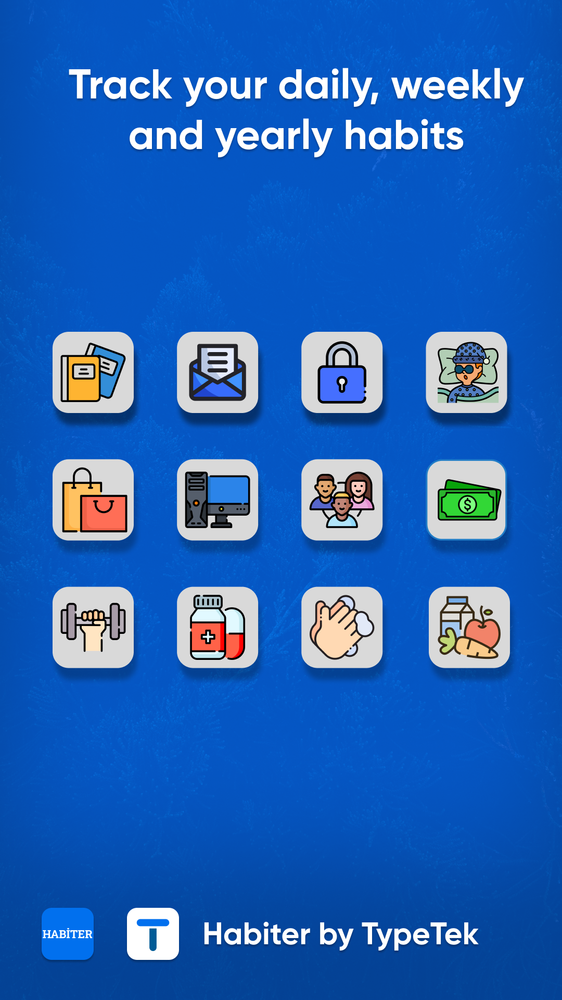
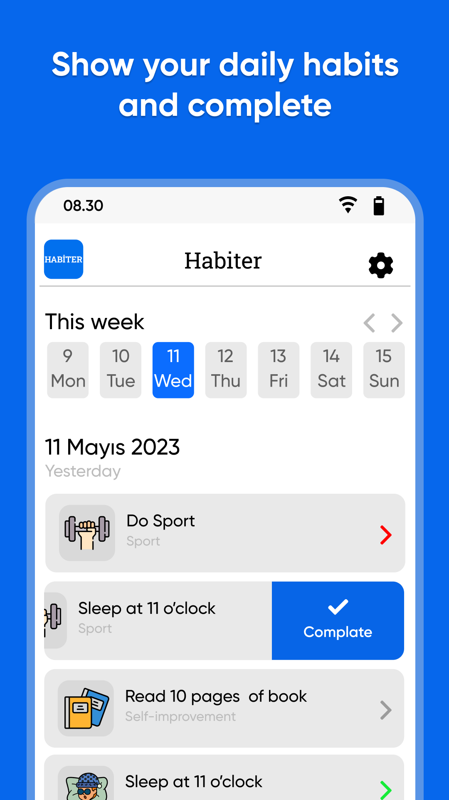
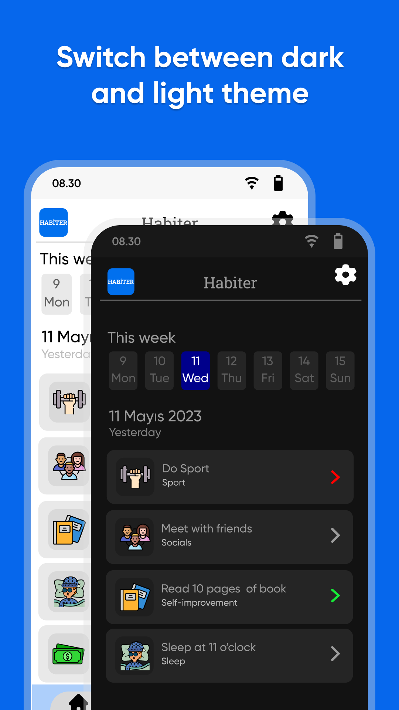
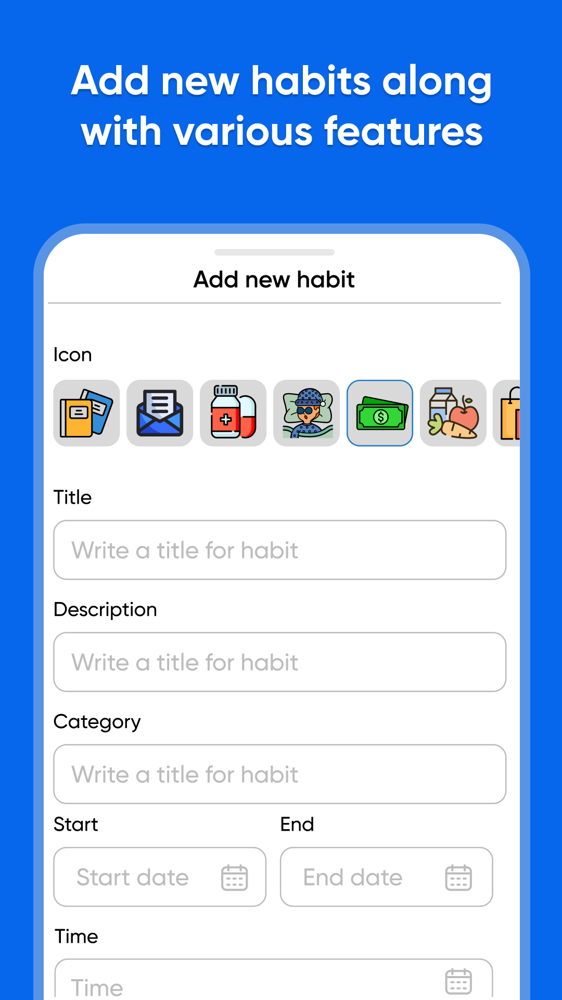
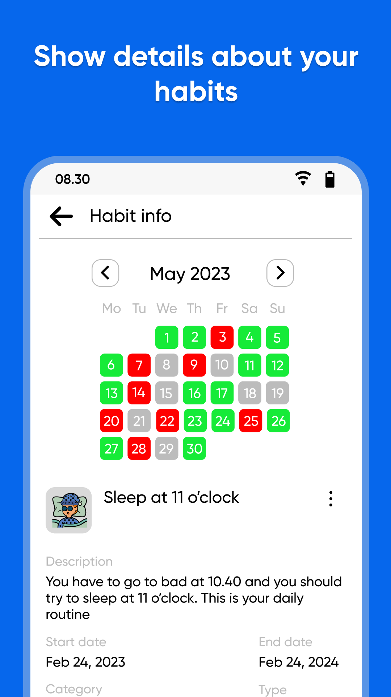
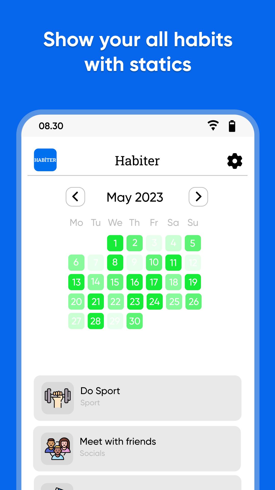
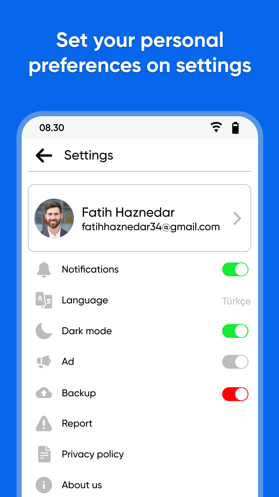
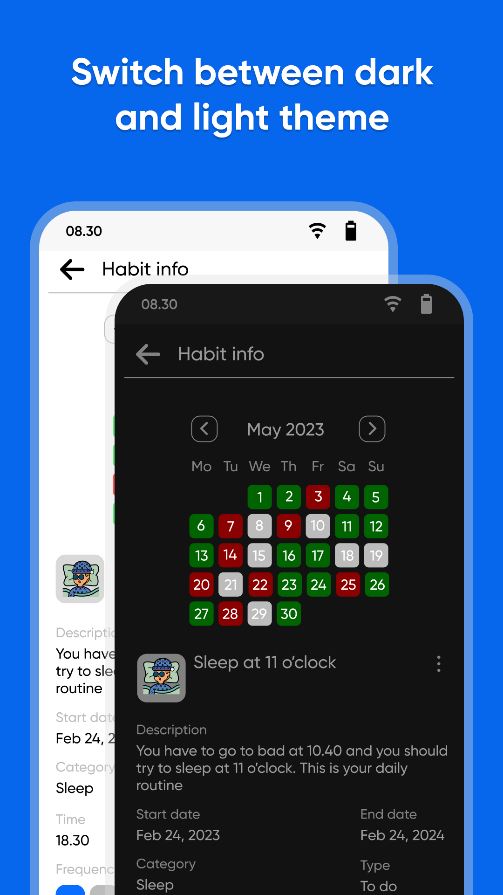
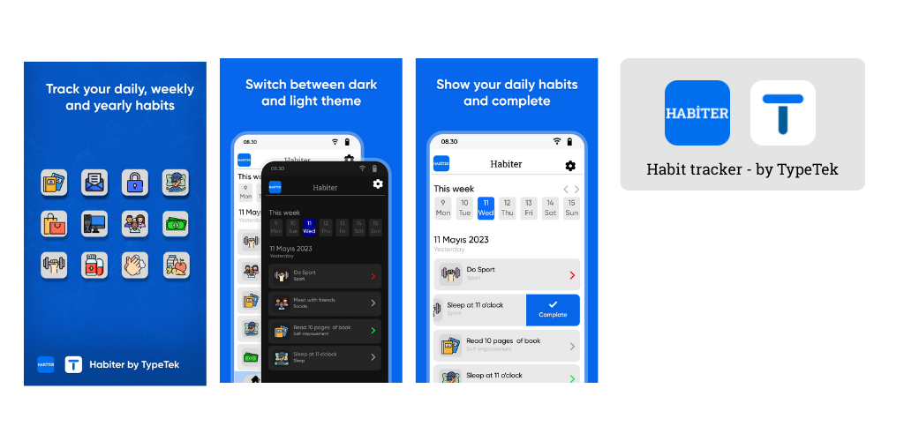

# Habit Tracker - Alışkanlık Takip Uygulaması

Bu uygulama, kullanıcıların günlük alışkanlıklarını takip etmelerine, hedefler belirlemelerine ve zaman içindeki ilerlemelerini görselleştirmelerine yardımcı olmak için tasarlanmış bir Flutter projesidir.

## ✨ Özellikler

*   **Alışkanlık Oluşturma:** Kolayca yeni alışkanlıklar ekleyin.
*   **Takvim Görünümü:** Alışkanlıklarınızı haftalık ve aylık takvim üzerinde takip edin.
*   **İlerleme Takibi:** Isı haritaları (heatmap) ve istatistiklerle ilerlemenizi görselleştirin.
*   **Hatırlatıcılar:** Alışkanlıklarınız için bildirimler ve hatırlatıcılar ayarlayın.
*   **Kişiselleştirme:** Alışkanlıklarınıza özel simgeler ve renkler atayın.
*   **Çoklu Dil Desteği:** Türkçe ve İngilizce dil seçenekleri.

## 📱 Ekran Görüntüleri

| | |
|:-------------------------:|:-------------------------:|
| | |
| | |
| | |
| | |

<p align="center">
  
</p>

## 🚀 Başlarken

Bu projeyi yerel makinenizde kurmak ve çalıştırmak için aşağıdaki adımları izleyin.

### Gereksinimler

*   [Flutter SDK](https://flutter.dev/docs/get-started/install)
*   [Git](https://git-scm.com/downloads)

### Kurulum

1.  Bu depoyu klonlayın:
    ```sh
    git clone https://github.com/yasinyildizdev/habit-tracker.git
    ```
2.  Proje dizinine gidin:
    ```sh
    cd habit-tracker
    ```
3.  Gerekli paketleri yükleyin:
    ```sh
    flutter pub get
    ```
4.  Uygulamayı çalıştırın:
    ```sh
    flutter run
    ```

## 🛠️ Kullanılan Teknolojiler

*   **Flutter:** Çapraz platform uygulama geliştirme çerçevesi.
*   **Hive:** Hızlı ve hafif bir NoSQL veritabanı.
*   **GetX:** Durum yönetimi, rota yönetimi ve bağımlılık ekleme için bir mikro çerçeve.
*   **i18n:** Uluslararasılaştırma ve yerelleştirme.